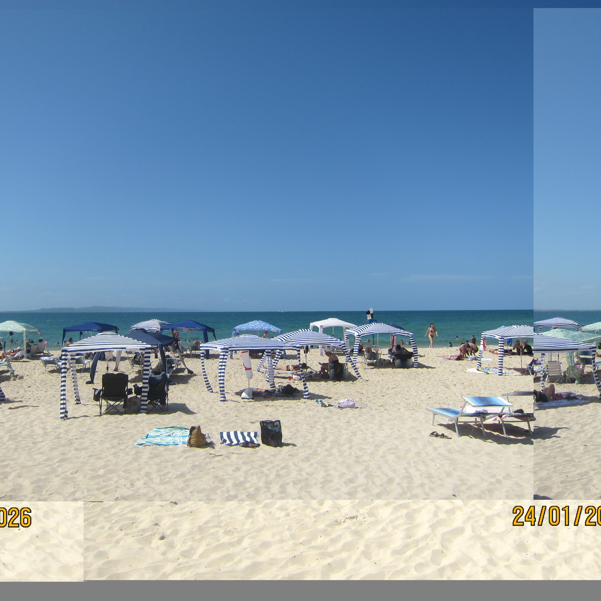
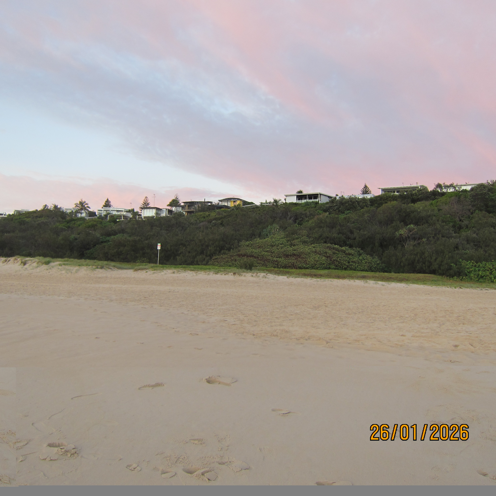

# Carve

Carve is a two-stage digital photo recovery system that combines deterministic binary-level JPEG carving with camera-aware reconstruction, explicitly separating raw data recovery from structural repair.

I went on a trip with a an old Canon IXUS I'd just picked up, came home, and found half my shots corrupted by a failing SD card. I built Carve to recover them — and to learn Rust.

Traditional file carvers look for `FF D8` and copy bytes until `FF D9`. That works for simple cases, but it breaks down when the JPEG header is damaged, the entropy stream is truncated, or the carve begins at the wrong alignment. Carve goes further: it parses JPEG structure, scans entropy-coded data safely, and then attempts camera-aware reconstruction for Canon IXUS 310 HS images.

The project has two distinct recovery phases:

- Phase 1: entropy-aware JPEG carving from raw bytes
- Phase 2: camera-aware reconstruction using a Canon IXUS 310 HS profile plus entropy offset search

## Example Results

Real recoveries from the pipeline:

<table>
  <tr>
    <td align="center"></td>
    <td align="center"></td>
  </tr>
  <tr>
    <td align="center"><code>IMG_1373</code> — recovered from fragmented/truncated storage data</td>
    <td align="center"><code>IMG_1403</code> — recovered from corrupted storage data</td>
  </tr>
</table>

When you run the CLI with `--rebuild` or `--offset-search`, Carve writes both the raw carved candidate and the rebuilt variants so they can be compared side by side.

## Why JPEG Recovery Is Hard

JPEGs have a structured header followed by an entropy-coded scan:

```text
SOI -> APP segments -> DQT -> SOF -> DHT -> SOS -> Entropy stream -> EOI
```

The header is parseable. The entropy stream is not; it is compressed bitstream data with JPEG-specific rules:

- `FF 00` is byte stuffing, not a marker
- `RST0` to `RST7` may appear inside the entropy stream
- a missing `EOI` may mean the image is truncated, not absent
- the wrong quantisation or Huffman tables can decode into severe color/block artifacts even if the entropy bytes are intact

That means a serious JPEG carver has to do more than copy bytes between two markers.

## Core Algorithms & Techniques

### Entropy-aware JPEG scanning

Instead of naively copying bytes from `FF D8` to `FF D9`, Carve walks the JPEG entropy stream while respecting byte stuffing (`FF 00`) and valid in-stream marker behaviour. This reduces false end-of-image detection and makes truncated or partially corrupted candidates recoverable enough to analyse further.

### Candidate scoring and ranking

Recovered candidates are ranked rather than blindly emitted. The current pipeline uses entropy-based heuristics such as Shannon entropy, byte diversity, and invalid marker penalties to prioritise plausible JPEG streams and suppress weaker overlapping candidates.

### Camera-specific header reconstruction

For Canon IXUS 310 HS images, Carve rebuilds a minimal valid JPEG header from a camera profile derived from clean reference files. Reusing invariant DQT/DHT tables and the known SOF/SOS structure makes it possible to decode candidates even when the original on-disk header is missing, damaged, or partially overwritten.

### Entropy offset search

Some corrupted candidates begin decoding mid-MCU, which produces horizontal shifts, repeated blocks, or seam-like artifacts. Carve mitigates this by trying bounded offsets into the carved entropy stream and ranking the rebuilt outputs, allowing the pipeline to recover better-aligned decodes without changing the underlying recovery assumptions.

### Decode-aware validation

Entropy statistics are useful, but they cannot measure whether a reconstructed image actually looks correct. Carve includes an opt-in scoring layer (`--decode-score`) that evaluates decoded pixel output directly (checking color coherence, pixel entropy, and artifacts) so the system can prefer visually coherent recoveries over candidates that merely resemble valid compressed data. Because pixel-by-pixel decoding is computationally expensive, this is disabled by default.

## Recovery Pipeline

```text
Disk image / raw byte stream
        |
        v
JPEG marker detection
Find candidate SOI offsets
        |
        v
Pre-SOS header parsing
Validate marker order and extract dimensions/metadata
        |
        v
Entropy stream scanning
Walk compressed bytes while respecting FF 00 and restart markers
        |
        v
Candidate validation
Classify complete vs truncated, optionally patch missing EOI
        |
        v
Candidate ranking + overlap suppression
Keep the strongest candidate for each overlapping region
        |
        v
Phase 1 output
Write recovered_NNN.jpg + report.jsonl
        |
        v
Phase 2 rebuild (optional)
Apply Canon IXUS 310 HS profile and try entropy offsets
        |
        v
Recovered JPEG variants
Write rebuilt_NNN.jpg / rebuilt_NNN_offset_MMMM.jpg
```

## Phase 1 vs Phase 2

Phase 1 is the generic recovery path:

- scan for JPEG candidates
- parse up to `SOS`
- scan the entropy stream safely
- validate and score candidates
- extract the best byte ranges as recovered JPEGs

Phase 2 is camera-aware and currently focused on Canon IXUS 310 HS:

- rebuild a clean JPEG header from the camera profile
- inject recovered width and height into `SOF0`
- reuse camera-specific table/header fields where available
- try small offsets into the entropy stream to correct MCU alignment issues
- rank rebuilt variants to help pick the best output

## Camera-Specific Recovery

Analysis of the Canon IXUS 310 HS reference set showed that the camera emits a highly stable baseline JPEG structure:

- marker order is stable: `SOI -> APP1 -> DQT -> SOF0 -> DHT -> SOS`
- quantisation tables are invariant across the analyzed images
- Huffman tables are treated as camera-specific reusable data in the reconstruction model
- the `SOF0` template is stable except for width and height
- no `DRI` segment was observed for this camera

That makes reconstruction practical:

- `DQT` can be reproduced from the Canon profile
- `SOF0` can be rebuilt with recovered dimensions
- `SOS` can be reproduced from the Canon profile
- `DHT` payloads can be attached from reference extraction when building a full camera-specific header

Why this matters: if the entropy stream is mostly intact but the original on-disk header is wrong or partially overwritten, a rebuilt camera-correct header is often the difference between a broken decode and a usable image.

## Architecture

```text
crates/
  carve-core/
    src/
      jpeg/
        markers.rs        JPEG marker constants/helpers
        parse.rs          pre-SOS parser and header validation
        entropy.rs        entropy stream scanner
        validate.rs       candidate validation and confidence scoring
        meta.rs           SOF metadata extraction
        restart_scan.rs   restart marker analysis
        marker_dump.rs    JPEG segment dump utility
      reconstruct/
        camera_profile.rs Canon-specific header profile model
        header_builder.rs synthetic JPEG header builder
        rebuilder.rs      phase 2 JPEG rebuild + offset search
        scorer.rs         entropy-based ranking for rebuilt outputs
      scanner.rs          end-to-end candidate recovery orchestration
      extract.rs          recovered file writer
      report.rs           JSONL report writer
      fragmented.rs       fragmented recovery helpers
  carve/
    src/
      main.rs            CLI entry point and pipeline wiring
```

At a high level:

- `jpeg/` handles low-level JPEG structure and entropy-safe scanning
- `scanner.rs` turns those primitives into ranked recovery candidates
- `reconstruct/` handles camera-aware rebuilding for Phase 2
- `extract.rs` and `report.rs` turn results into files the user can inspect

## Running the Tool

Build and test:

```bash
cargo build --release
cargo test
```

Recover JPEGs from one or more raw inputs:

```bash
carve image.bin
carve sector_001.bin sector_002.bin sector_003.bin
carve "sectors/*.bin"
```

Keep all overlapping candidates:

```bash
carve --keep-overlaps image.bin
```

Run Phase 2 Canon-aware rebuilding:

```bash
carve --rebuild image.bin
carve --offset-search --offset-max 512 image.bin
```

Enable decode-aware scoring for higher confidence rankings:

```bash
carve --rebuild --decode-score image.bin
```

Inspect JPEG structure instead of carving:

```bash
carve --dump image.jpg
carve --dump --json image.jpg
```

Typical output layout:

```text
recovered/
  image/
    recovered_000.jpg
    rebuilt_000.jpg
    rebuilt_000_offset_0000.jpg
    rebuilt_000_offset_0001.jpg
    report.jsonl
```

`report.jsonl` records offsets, status, dimensions, confidence, and corruption flags for each candidate.

## Limitations

- Partial entropy corruption can still make the recovered image decode badly or fail entirely.
- Overwritten data cannot be reconstructed if the original compressed bytes are gone.
- If dimensions cannot be recovered, Phase 2 rebuild output may be skipped.
- Extreme fragmentation is still a hard case; the current pipeline does not fully reassemble arbitrary multi-fragment JPEGs.
- Progressive JPEGs are not the focus of the current reconstruction path.
- Canon IXUS 310 HS is the documented camera-specific profile today; generic carving works more broadly than camera-aware rebuilding.

## Future Work

- stronger fragment reassembly across non-contiguous clusters
- better entropy alignment heuristics
- multi-camera profile support
- progressive JPEG recovery
